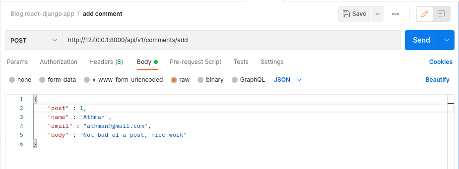

# :soccer: Blog
> :bulb: **Project** 1/4
## 💬 Description
> This is a full stack project that is build with django and react

## 📜 More
> Backend
  1. API to get the posts added by author
     > A blog API that gets users posts that is to be promped by the frontend
     <details>
      <summary>Postman screenshot</summary>
      
      
     </details>
  1. API to get one post
     > A blog API that gets a specific post by passing id
     <details>
      <summary>Postman screenshot</summary>
      
      
     </details>
  1. API to get comments
     > A blog API endpoint that gets all comments for all posts
     <details>
      <summary>Postman screenshot</summary>
      
      
     </details>
  1. API to get one comment
     > A blog API endpoint that gets one comment for a post by passing id
     <details>
      <summary>Postman screenshot</summary>
      
      
     </details>
  1. API to add comment
     > A blog API endpoint that adds a comment for a post
     <details>
      <summary>Postman screenshot</summary>
      
      
     </details>


## 🔧 Code Setup
   1. Clone the repo
        ```
            git clone https://github.com/devoure/

        ```
   1. Move into the project file
        ```bash
            cd mongo-hrms

        ```
## 💻🏃‍♂️ Running Code Snippet


