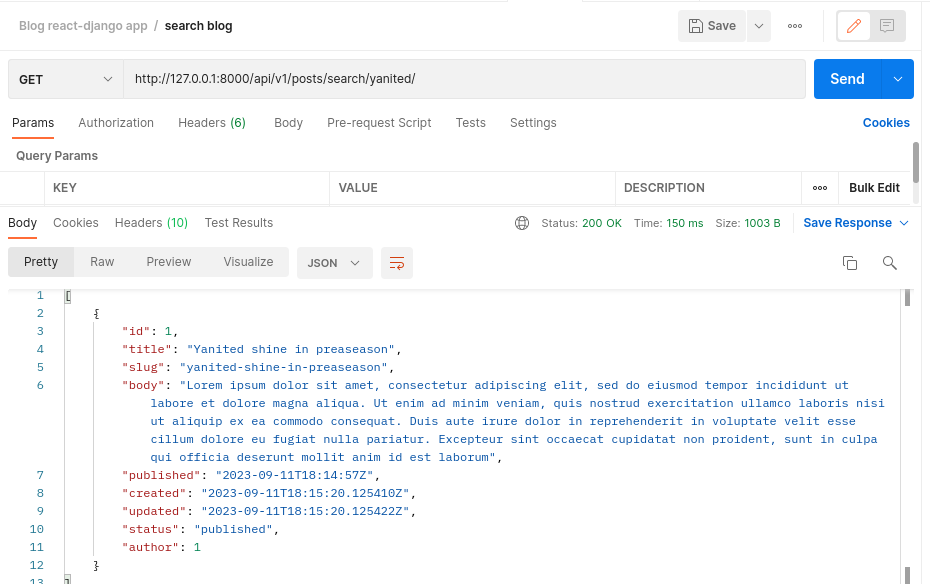

# :soccer: Blog
> :bulb: **Project** 1/4
## 💬 Description
> This is a full stack project that is build with django and react

## 📜 More
> ## Database
  1. The app;ication is using Postgres database running on a docker container
     > The database is connected to the app using the port 5432
     <details>
      <summary>Postman screenshot</summary>
      
      
     </details>

> ## Backend
  1. API endpoint to get the posts added by author
     > A blog API that gets users posts that is to be promped by the frontend
     <details>
      <summary>Postman screenshot</summary>
      
      
     </details>
  1. API endpoint to get one post
     > A blog API that gets a specific post by passing id
     <details>
      <summary>Postman screenshot</summary>
      
      
     </details>
  1. API endpoint to get comments
     > A blog API endpoint that gets all comments for all posts
     <details>
      <summary>Postman screenshot</summary>
      
      
     </details>
  1. API endpoint to get one comment
     > A blog API endpoint that gets one comment for a post by passing id
     <details>
      <summary>Postman screenshot</summary>
      
      
     </details>
  1. API endpoint to add comment
     > A blog API endpoint that adds a comment for a post
     <details>
      <summary>Postman screenshot</summary>
      
      
     </details>
  1. API endpoint to get posts by tags
     > A blog API endpoint that gets posts that much a tag passed by the url
     <details>
      <summary>Postman screenshot</summary>
      
      
     </details>
  1. API endpoint to get simillar posts
     > A blog API endpoint that gets simillar posts from one selected
     <details>
      <summary>Postman screenshot</summary>
      
      
     </details>
  1. API endpoint to search for text in the blog 
     > A blog API endpoint that gets a search in the title and body of the Posts saved in the database
     <details>
      <summary>Postman screenshot</summary>
      
      
     </details>
> ## Frontend
  1. Search
     > The frontend allows to search the blog with words and phrases in the title and body of articles posted
     <details>
      <summary>Frontend Screenshot</summary>
      
      
     </details>
  1. Filter Posts and Latest Posts
     > The frontend allows user to filter the posts with tags, to show only posts for a certain category. Also the frontend allows to show
     latest posts on the sidebar
     <details>
      <summary>Frontend screenshot</summary>
      
      
     </details>
  1. Popular post and Pagination
     > The frontend allows user to view popular posts, those are most people have commented on. The frontend also provides pagination for the posts.
     <details>
      <summary>Frontend screenshot</summary>
      
      
     </details>

  1. Post Detail
     > The frontend allows user to view a single post and read full article
     <details>
      <summary>Frontend screenshot</summary>
      
      
      

     </details>
  1. Comments
     > The frontend allows user to view comments on a post and also comment on a post
     <details>
      <summary>Frontend screenshot</summary>
      
      

     </details>
  1. Mobile Responsive
     > The frontend allows you to view the blog with your mobile phone, laptop and tablet with a responsive UI
     <details>
      <summary>Frontend screenshot</summary>
      
      
      
      
      

     </details>


> ## Docker
  1. The frontend, backend, postgres database and nginx proxy are dockerized and runned with a single docker-compose file.
     > The images are also deployed on docker hub and here is a screenshot of the running containers.
     <details>
      <summary>Containers Running</summary>
      
      
     </details>
  1. Docker hub images
     > Frontend image
     ```bash

        docker pull devourey/frontend-sokablog:latest

     ```
     > Backend image
     ```bash

        docker pull devourey/backend-sokablog:latest

     ```


## 🔧 Code Setup
   1. Clone the repo
        ```bash
            git clone https://github.com/devoure/soka-blog

        ```
   1. Move into the project file
        ```bash
            cd soka-blog

        ```
   1. Setup Docker container for postgres
        ```bash
            systemctl start docker
            docker-compose -f ./docker/postgresConfig.yml up
        ```
   1. Setup Backend
        ```bash
            cd backend/blog/
            python manage.py makemigrations
            python manage.py migrate
            python manage.py create superuser

        ```

## 💻🏃‍♂️ Running Code Snippet
   1. Run Backend code
        ```bash
            cd backend/blog/
            python manage.py runserver

        ```
   1. Run Frontend Code
        ```bash
            cd frontend/sokaBlog
            npm run dev

        ```
   1. Run All Components together with docker
        ```bash
            cd docker
            docker-compose -f docker-compose-dev.yml up

        ```
        or
        ```bash
            cd docker
            docker-compose -f docker-compose-prod.yml up

        ```


